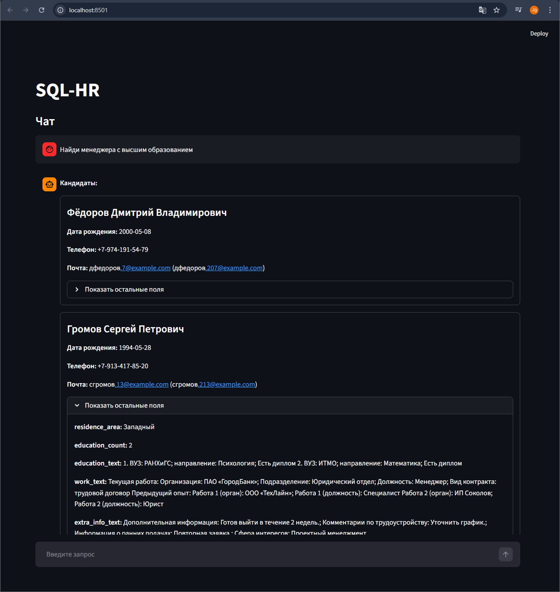

# SQL-HR

SQL-HR — сервис подбора кандидатов по базе резюме с использованием LLM и LangGraph. 
Хранилище — PostgreSQL, сервер агентов — FastAPI, UI — Streamlit. 
LLM подключается по OpenAI-совместимому API (например, llama.cpp server).

**Ключевая идея:** главный агент ведет диалог и вызывает инструмент поиска, а вспомогательный агент генерирует QuerySpec и выбирает кандидатов в несколько итераций.

**Архитектура**
- `postgres` хранит резюме и обслуживает фильтры по ключевым словам и датам.
- `agent_server` содержит LangGraph с главным агентом и субагентом, а также FastAPI для UI.
- `vllm` (llama.cpp server) предоставляет LLM API.
- `frontend` (Streamlit) — чат-интерфейс.

---

**Алгоритм работы**
1. Пользователь формулирует запрос в UI.
2. `frontend` отправляет сообщение в `agent_server` (`POST /`).
3. Главный агент (`main_agent_node`) анализирует запрос и, если нужно, вызывает инструмент `find_candidates`.
4. `find_candidates` запускает субагента:
   - Вход: исходный запрос + контекст последних сообщений.
   - Субагент итеративно генерирует три спецификации поиска `QuerySpecBundle` (ideal/match/fallback).
   - На каждой итерации вызывается `db_search` с тремя запросами.
   - Каждый SQL-запрос возвращает до 20 кандидатов.
   - **Реранкинг:** CrossEncoder переранжирует до 20 кандидатов по релевантности к запросу и возвращает топ-5.
   - На каждой итерации субагент возвращает лучших кандидатов.
5. Главный агент получает результат `find_candidates`, сохраняет набор кандидатов в памяти сессии и отдает их на UI.
6. UI показывает карточки кандидатов. При запросе деталей конкретных кандидатов используется `get_candidate_by_id`.
7. В процессе поиска UI опрашивает `GET /session/{session_id}/candidates/current` и может остановить поиск через `POST /session/{session_id}/stop`.

---

**Агенты и их роли**
- **Главный агент** (`main_agent_node`):
  - Ведет диалог.
  - Решает, когда запускать поиск.
  - Возвращает итоговый ответ и компактный список кандидатов.
- **Субагент** (`sub_agent_node`):
  - Специалист по генерации QuerySpec.
  - Строит 3 варианта запросов (ideal/match/fallback).
  - Делает несколько итераций, пока не найдет кандидатов или не исчерпает лимит.
- **Инструменты**:
  - `find_candidates`: оркестрация работы субагента.
  - `db_search`: выполнение поиска по базе с помощью QuerySpec.
  - `get_candidate_by_id`: выборка детальной информации по UUID.

---

**Структура проекта**
- `agent_server/` — основной сервис агентов и API.
  - `main.py` — LangGraph, FastAPI, инструменты, хранение сессий.
  - `candidates.py` — ORM-модель и Pydantic-схемы.
  - `prompts.py` — системные промпты для агентов.
  - `reranker.py` — модуль реранкинга кандидатов через CrossEncoder.
  - `requirements.txt`, `Dockerfile`.
- `frontend/` — Streamlit UI.
  - `chat.py` — клиент чата, polling статуса, отрисовка кандидатов.
  - `requirements.txt`, `Dockerfile`.
- `db/` — подготовка данных и схема БД.
  - `schema.sql` — таблица `candidates`.
  - `add_rows.sql` — загрузка данных из `candidates_clean.csv` в `candidates`.
  - `00-preprocess.sh` — предобработка CSV (валидация, чистка дат, лог ошибок).
  - `header_spec.txt` — эталонный список заголовков CSV.
  - `Dockerfile.postgres` — Postgres + python для предобработки.
- `data/` — исходные и подготовленные CSV.
  - `candidates.csv` — исходный файл.
  - `candidates_clean.csv` — подготовленный CSV для импорта.
  - `candidates_bad.csv`, `candidates_bad_rows.txt` — проблемные строки.
- `results/` — результаты работы агентов.
  - `result.txt` — итоговый JSON с кандидатами (если включена запись).
  - `sup_agent_report_*.txt` — логи работы субагента.
  - `speed_*.txt` — метрики времени по узлам.
- `docker-compose-prod.yml` — запуск готовых образов.
- `docker-compose-test.yml` — локальная сборка сервисов.
- `env.example` — пример переменных окружения.

---

**Подготовка данных**
1. При старте Postgres выполняется `db/00-preprocess.sh`.
2. Скрипт проверяет CSV по `db/header_spec.txt`.
3. Валидные строки попадают в `data/candidates_clean.csv`.
4. Ошибочные строки и их причины сохраняются в `data/candidates_bad.csv` и `data/candidates_bad_rows.txt`.
5. Затем `db/add_rows.sql` загружает `candidates_clean.csv` в таблицу `candidates`.

---

**Установка и запуск (Docker)**
1. Подготовьте окружение:
   ```bash
   cp env.example .env
   ```
2. Проверьте ключевые переменные:
   - `POSTGRES_*`
   - `LLAMA_MODEL`, `LLAMA_BASE_URL`, `LLAMA_HOST_PORT`
   - `RESULTS_DIR`, `REPORT_DIR`, `SAVE_LOGS`
   - `ENABLE_RERANKING`, `RERANKER_MODEL`, `RERANKER_TOP_K` (настройки реранкинга)
   - наличие candidates.csv в папке `data`

**Вариант 1. Локальная сборка**
```bash
docker compose -f docker-compose-test.yml up --build
```

**Вариант 2. Готовые образы**
```bash
docker compose -f docker-compose-prod.yml up
```

**UI**
```text
http://localhost:18501
```

**Запуск `auto_frontend`**
1. Сначала поднимите API агента и Postgres:
   ```bash
   docker compose -f docker-compose-api.yml up --build postgres agent_server
   ```
2. Убедитесь, что healthcheck отвечает:
   ```text
   http://localhost:8010/health
   ```
3. Затем запускайте батч-скрипт:
   ```bash
   cd auto_frontend
   python run.py
   ```
4. Если агент доступен не на `http://localhost:8010`, задайте `AGENT_URL`.

---

**Примечания**
- Поиск лексический: ключевые слова ищутся как подстроки в текстовых полях.
- Максимум 20 кандидатов извлекается из базы на один запрос.
- Реранкинг: из 20 кандидатов CrossEncoder отбирает топ-5 по релевантности к запросу пользователя.
- Модель реранкинга: `cross-encoder/ms-marco-MiniLM-L-6-v2` (CPU-friendly).
- Время реранкинга логируется в файлы `speed_*.txt`.

---

**Реранкинг кандидатов**

Система использует двухэтапный подход для повышения качества подбора:

1. **Лексический поиск (SQL)**: Извлекает до 20 кандидатов по ключевым словам.
2. **Семантический реранкинг (CrossEncoder)**: Переранжирует кандидатов по релевантности к запросу пользователя.

**Как работает:**
- Модель `cross-encoder/ms-marco-MiniLM-L-6-v2` оценивает каждую пару (запрос, кандидат).
- Текст кандидата формируется из: ФИО, место жительства, образование, опыт работы, доп. информация.
- Кандидаты сортируются по убыванию оценки релевантности.
- Возвращается топ-K кандидатов (по умолчанию 5).

**Настройка:**
```env
ENABLE_RERANKING=True                                      # Включить/выключить реранкинг
RERANKER_MODEL=cross-encoder/ms-marco-MiniLM-L-6-v2      # Модель CrossEncoder
RERANKER_MAX_LENGTH=512                                   # Максимальная длина текста
RERANKER_TOP_K=5                                          # Количество кандидатов для возврата
```

**Производительность:**
- Модель работает на CPU, обработка 20 кандидатов занимает ~0.5-2 сек (зависит от CPU).
- Время выполнения логируется в `results/speed_*.txt` с меткой `rerank`.

**Отключение:**
Установите `ENABLE_RERANKING=False` для возврата к базовому поиску без реранкинга.
